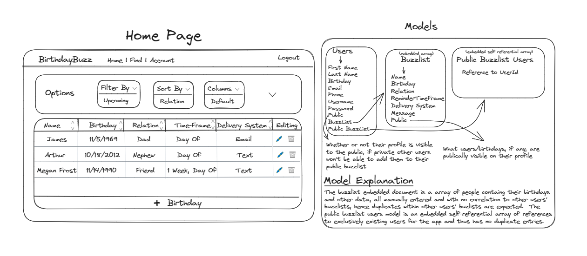

<div align="center">
    
</div>

# **About**

Never forget another birthday! Birthday Buzz is a MERN stack application that sends you email reminders when it's someone's birthday. Simply add your friends and family to your "buzz list" and we'll automatically send you a customized reminder when they're birthday is coming up or on the day of.

### Features

- Email verification required for all user accounts (no spam/malicious usage)
- Quick & Simple process to add friends and family to your "buzz list" (reminder list)
- Choose when you want to be reminded
- Create a custom reminder message
  <br></br>

# **Built With**

<span style="margin-inline:4px"></span>
<span style="margin-inline:4px"></span>
<span style="margin-inline:4px"></span>
<span style="margin-inline:4px"></span>
<span style="margin-inline:4px"></span>
<span style="margin-inline:4px"></span>
<span style="margin-inline:4px"></span>
<span style="margin-inline:4px"></span>

<br />

# Deployment

- Frontend deployed online at [BirthdayBuzz](https://birthdaybuzz.io)
- Backend deployed on [Heroku](https://birthday-buzz-backend-85f63d7d1452.herokuapp.com/)
- Frontend Github Repo [Github](https://github.com/LeifCastle/BirthdayBuzz-frontend)
- Backend Github Repo [Github](https://github.com/LeifCastle/BirthdayBuzz-backend)

<br />

# Getting Started

### Prerequisites

- Node.js
- MongoDB database - local install or [Mongo Atlas](http://mongodb.com/atlas)
- A [Sendgrid](https://signup.sendgrid.com/) API key
- A [Twilio](https://www.twilio.com/try-twilio) Account (Account SID, Service SID, and AUTH Token needed)

### Backend

1. `fork` and `clone` the [Birthday Buzz Backend](https://github.com/LeifCastle/BirthdayBuzz-backend) repository.

```zsh
git clone https://github.com/your-username/BirthdayBuzz-backend.git
cd BirthdayBuzz-backend
```

2. Install dependencies.

```zsh
npm install
```

3. Create a `.env` file in the repository root and add the follow environment variables:

```
MONGO_URI=insert-your-database-uri-here
JWT_SECRET=secret-key-of-your-choice
SENDGRID_API_KEY=your-sendgrid-api-key
TWILIO_ACCOUNT_SID=your-twilio-account-sid
TWILIO_AUTH_TOKEN=your-twilio-auth-token
TWILIO_SERVICE=your-twilio-service-sid
```

4. Start the backend server.

```zsh
npm run dev
```

### Frontend

1. `fork` and `clone` the [Birthday Buzz Frontend](https://github.com/LeifCastle/BirthdayBuzz-frontend) repository.

```zsh
git clone https://github.com/your-username/BirthdayBuzz-frontend
cd BirthdayBuzz-frontend
```

2. Install dependencies.

```zsh
npm install
```

3. Create a `.env` file in the repository root and add the following environment variable:

```
NEXT_PUBLIC_SERVER_URL=http://localhost:8000
```

4. Start the frontend server.

```zsh
npm run dev
```

5. Open [http://localhost:3000](http://localhost:3000) with your web browser to experience the app.

### Notification Engine

- Set up a recurring engine to run `node bin/sendDailyEmail.js` on the backend server.
- The deployed version of Birthday Buzz uses `Heroku Scheduler` for this purpose.

<br />

# **Screenshots**

...coming soon

<br />

# Frontend Code Snippets

- See the README in the [Backend Repo](https://github.com/LeifCastle/BirthdayBuzz-backend) for backend code snippets.

...coming soon

<br />

# Wireframing and Entity Relationship Diagram



<br />

# Stretch Goals

### Coming Soon

- UI/UX styling overhaul
- Edit Buzzlist entries
- Delete Buzzlist entries
- Fix Find page bugs
- Implement "Day Before" reminder time frame option
- Implement entry specific reminder message

### Future Enhancements

- Add several more reminder time frame options
- Add an "Upcoming page" (stylized list of buzzlist entries with an upcoming birthday)
- Add alternative mobile reminder texts
- Let users bulk add buzzlist entries from their contacts

<br />

# Resources

- [Twilio](https://www.twilio.com) - A cloud communication platform that provides a range of APIs for developers to integrate text messaging, emailing, and more into their applications.
- [SendGrid](https://sendgrid.com) - A cloud-based emailing platform builty by Twilio that offers web service APIs to automate email messaging.
- [Heroku Scheduler](https://elements.heroku.com/addons/scheduler) - A Heroku add-on for running jobs on your app at scheduled time intervals, much like cron in a traditional server environment.

<h2 align="center">Authors</h2>

<div align="center">
  <a href="https://github.com/darkartaudio">
    
  </a>
   <a href="https://github.com/Ellehcim23">
    
  </a>
</div>
